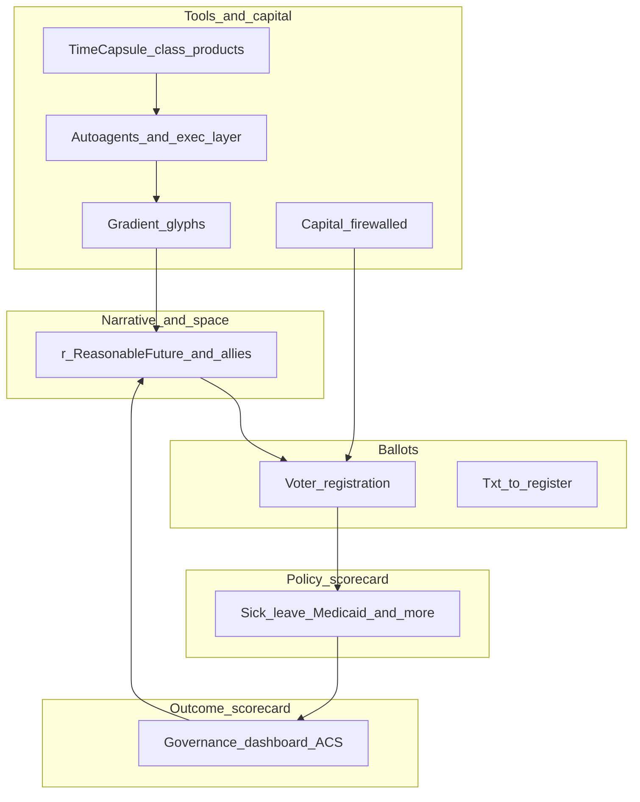

# Reasonable Future

## Vision stack (how the pieces connect)

**Root:** *Rules for a Reasonable Future* — employment status must not exclude people from baseline dignity.

---

## Six rules (anchor)

1. Eating well & clean water  
2. Home with heating, cooling & electricity  
3. Healthcare access  
4. Adequate clothing  
5. Internet, transit & education  
6. Room for a **fulfilled life**

*All other images and campaigns are umbrellas from this manifesto.*

---

## Flywheel (theory of change)



---

## Evidence layer

- **Policy:** what law requires (sick leave, Medicaid expansion, …)  
- **Outcomes:** poverty, insurance, rent burden, SNAP, broadband, health, air  
- **Dashboard:** same yardstick, every state, refreshable vintage  

*Measure “life needs,” not GDP alone.*

---

## Execution layer

| Lane | Role |
|------|------|
| **Glyphs** | Compact, inspectable data + messaging + revenue |
| **TimeCapsule-class** | Trust, legacy, optional consented insight |
| **Agents + “frontal lobe”** | Prioritize → build → ship |
| **Capital** | Funds the civic stack; keep narrative firewall clear |

---

## Horizon (~20 years)

**Complete** = Rules reflected in **durable institutions** (law, budgets, norms) to a defined bar — not one hero, **coalitions + measurement + maintenance**.

**Quarterly:** ship outcomes · **5-year:** check distance to bar

---

## Export this deck

```bash
npx --yes @marp-team/marp-cli RFRF_VISION_DECK.md -o RFRF_VISION_DECK.pdf
# or HTML:
npx --yes @marp-team/marp-cli RFRF_VISION_DECK.md -o RFRF_VISION_DECK.html
```

Use VS Code **Marp for VS Code** extension for live preview.
